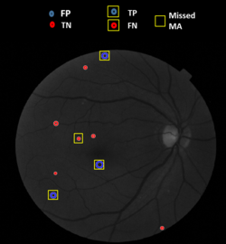

# Automatic-Microaneurysm-Detection-from-Color-Fundus-Images
The project addresses automatic detection of microaneurysms (MA) which are first detectable changes in Diabetic Retinopathy (DR). Green channel, being the most contrasted channel, of the color fundus images are considered. The algorithm includes pre-processing, MA candidates detection, features extraction, classification and comparison with ground truth to evaluate the performance of classifier model. This project was undertaken as a part of Digital Image Processing course in my Masters program at IIITB. The main purpose of sharing this repository is to encourage more reproducible research.

  

# How to get started?
The dataset used for this project is E-Ophtha-MA. I have uploaded some images in respective folders mentioned in code for trial purpose. 
The proposed algorithm was implemented on MATLAB R2019a platform.
All the libraries used are in-built and some functions are coded that are present in the main code file itself.
Steps to execute the code;
1) Download the .zip file.
2) Run the code 'MA_CandidatesDetection_FeatureExtraction.m'. This will pre-process the images, detect MA candidates, extract features from MA candidates and store them in .xls file. Mention the cell number of last entry of the file in the next code (A2:cell_no.) used for classification. I have also provided the .xls file containing the extracted features for direct use in next step of classification. 
3) Run the code 'MA_NonMA_Classification.m' to split data into training and testing to build and validate the classifier model. Also, a new unknown data is processed to detect MA candidates and identify true MA from false positives.

# Documentation
The user can find 'Automatic Microaneurysm Detection.pdf' file as a technical report on this project explaining each steps of the algorithm thoroughly. The block diagram and results obtained are also included in the report. This report will give the user a better understanding of the proposed method.

